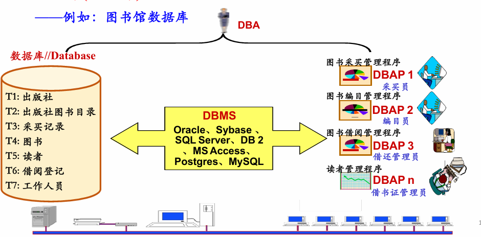

# 第一章——数据库系统的基本概念

## 1.1 数据库系统的基本概念
- 数据库(信息库):A database(DB) is a set of related data that is organized, shared, and persistent.也就是说，数据库是一组有相互关联的数据，特点是**有组织的**，**共享的**，**持久化的**
- 相关概念名：
  - 数据库(DB):Database
  - 数据库管理系统(DBMS):Database Management System
  - 数据库应用(DBAP):Database Application
  - 数据库管理员(DBA):Database Administrator
  - 用户:Users
  - 
- 数据库管理系统(系统软件)——从用户角度看DBMS的功能
  - 数据库定义(DDL:Data Definition Language):定义数据库中Table的名称、标题
  - 数据库操纵(DML:Data Manipulation Language):向数据库的Table中增加/删除/更新数据及对数据进行查询、检索、统计等
  - 数据库控制(DCL:Data Control Language):控制数据库中数据的使用(哪些用户可以用，哪些不可以)
  - 数据库维护:转储/恢复/重组/性能监测/分析...
- 数据库语言——使用者通过数据库语言利用DBMS操作数据库
  - 数据定义语言(DDL:Data Definition Language)DBMS提供给用户，以便用户定义数据格式
  - 数据操纵语言(DCL:Data Control Language)DBMS提供给用户，以便用户对数据进行操作
  - 数据控制语言(DCL:Data Control Language)DBMS提供给用户，以便用户对数据进行控制
  - 数据库各种操作的执行——DBMS按用户要求进行定义、操纵、控制和维护
## 1.2 《数据库系统》可成内容简介
## 1.3 数据库系统的标准结构
1. DBMS管理数据的三个层次:(外部)视图、全局视图、内部视图
   - External Level = User Level 某一用户能够看到和处理的数据，全局数据中的一部分
   - Conceptual Level = Logic Level 从全局角度理解/管理的数据，含相应的关联约束
   - Internal Level = Physical Level 存储在介质上的数据，含存储路径、存储方式、索引方式等
2. 模式的概念:外模式、(概念模式)、内模式
   - 模式(Schema)对数据库中数据所进行的一种结构性的面所观察到的数据的结构信息
   - 视图(View)某一种表现形式下表现出来的数据库中的数据
   - 也就是说，模式是数据的结构，视图是展现的数据
3. 数据库系统的标准结构
   1. 三级模式(三级视图)
      - External Schema —— (External View):某一用户能够看到与处理的数据的结构描述
      - (Conceptual) Schema —— Conceptual View:从全局角度理解/管理的数据的结构描述，含相应的关联约束体现在数据之间的内在本质联系
      - Internal Schema —— Internal View:存储在介质上的数据的结构描述，含存储路径、存储方式、索引方式等
    2. 两层映像
      - E-C Mapping: External Schema-Conceptual Schema Mapping
        - 将外模式映射为概念模式，从而支持实现数据概念视图向外部视图的转换
        - 便于用户观察和使用
      - C-I Mapping: Conceptual Schema-Internal Schema Mapping
        - 将概念模式映射为内模式，从而支持实现数据概念视图向内部视图的转换
        - 便于计算机进行存储和处理
    3. 两个独立性
        - 逻辑数据独立性：当概念模式变化时，可以不改变外部模式(只需改变E-C Mapping)，无需改变应用程序
        - 物理数据独立性：当内部模式变化时，可以不改变概念模式(只需改变C-I Mapping)，不改变外部模式
    4. 模式与模式结构：数据模型
        - 数据模型：
          - 规定模式统一描述方式的模型
          - 数据模型时对模式本身结构的抽象，模式是对数据本身结构形式的抽象
    5. 经典数据模型
        - 层次模型——树
        - 网状模型——图
        - 关系模型——表
4. 数据库系统的简要发展史及发展趋势