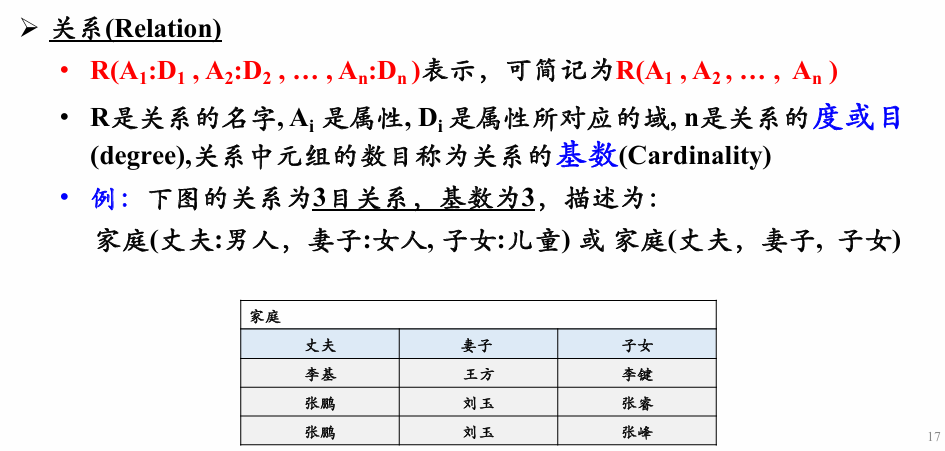

# 第二章——关系模型与关系运算

## 1. 关系模型与关系运算简述
1. 区分:关系模型，关系模式和关系
   1. 关系：关系模型的数据
   2. 关系模式：关系的抽象
   3. 关系模型：关系模式的抽象
   
### 1.1 关系模型的提出与作用
### 1.2 关系模型与关系运算概览
### 1.3 本章的目标
## 2. 关系与关系模型
### 2.1 关系
- 关系的定义
- > 关系是以内容来区分的，而不是以属性在关系中的位置来区分
- > 理论上任意两个元组不能完全相同，实际Table可能有完全相同的两行
- 关系的特性：**属性不可再分**性(又称关系第一范式)
- 关系上的一些重要概念
  - **候选码**(候选键):关系中的一个属性组，其值能唯一标识一个元组，若从该属性组中去掉任何一个属性，它就不具有这一性质了，这样的属性成为候选码.(**就是提取一些特征，能根据这些特征区分每一行，并且是最小的特征组合**)——**极小型，唯一性**
  - **主码**(主键):当有多个候选码时，可以选定一个作为主码
  - **主属性与非主属性**:包含在任何一个候选码中的属性被称作主属性，其他属性被称为非主属性。
    - 最简单的情况，候选码只包含一个属性
    - 最极端的情况，关系的所有属性组是这个关系的候选码，称为**全码**(All-Key)
  - **外码(Foreign Key)/外键**:关系R中的⼀个属性组，与另⼀个关系S的候选码相对应，则称这个属性组为R的外码或外键。
  - **超码**:是指⼀个或多个属性的集合，这些属性的组合可以使我们在⼀个实体集中唯⼀地标识⼀个实体。(**是一个集合**)
### 2.2 关系模型
 - 关系模型中的完整性
   - 关系的实体完整性：关系的主码中的属性值不能为空值
   - 关系的参照完整性：如果关系R1的外码Fk与关系R2的主码Pk相对应，则R1中的每⼀个元组的Fk值或者等于R2中某个元组的Pk值，或者为空值
   - 关系的用户自定义完整性：用户针对具体的应用环境定义的完整性的约束条件
 - 实体完整性和参照完整性由DBMS系统自动支持
## 3. 关系代数运算

