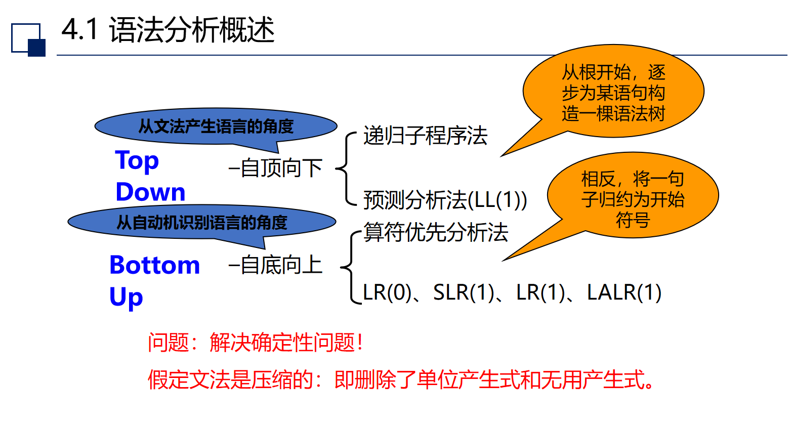

# 第四章——自顶向下的语法分析

## 4.1 语法分析概述

## 4.2 自顶向下的语法分析面临的问题
1. 问题：
    1. 二义性问题：
       - 对于文法G，如果L(G)中存在一个具有两棵或两棵以上分析树的句子，则称G是二义性的。
       - 也可以等价地说：如果L(G)中存在一个具有两个或两个以上最左(或最右)推导的句子，则G是二义性文法。
       - 如果一个文法G是二义性的，假设$w \in L(G)$且w存在两个最左推导，则在对w进行自顶向下的语法分析时，语法分析程序将无法确定采用w的哪个最左推导。
    2. 回溯问题:
        - 文法中每个语法变量A的产生式右部称为A的候选式，如果A有多个候选式存在公共前缀，则自顶向下的语法分析 程序将无法根据当前输入符号准确地选择用于推导的产生式，只能试探。当试探不成功时就需要退回到上一步推导，看A是否还有其它的候选式，这就是回溯(backtracking)。
    3. 左递归引起的无穷推导问题
2. 改造方法：
    1. 消除二义性：改造的方法就是通过引入新的语法变量等，使文法含有更多的信息。其实，许多二义性文法是由于概念不清，即语法变量的定义不明确导致的，此时通过引入新的语法变量即可消除文法的二义性。
    2. 消除左递归
    3. 提取左因子
3. LL(1)文法

## 4.3 预测分析法 
## 4.4 递归下降分析法 
## 4.5 本章小结

